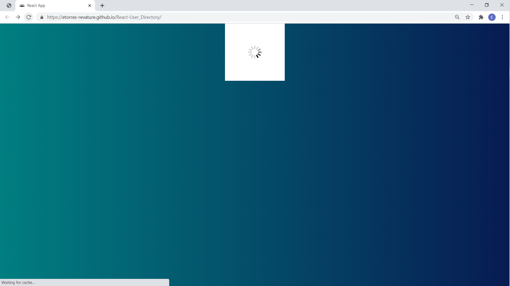
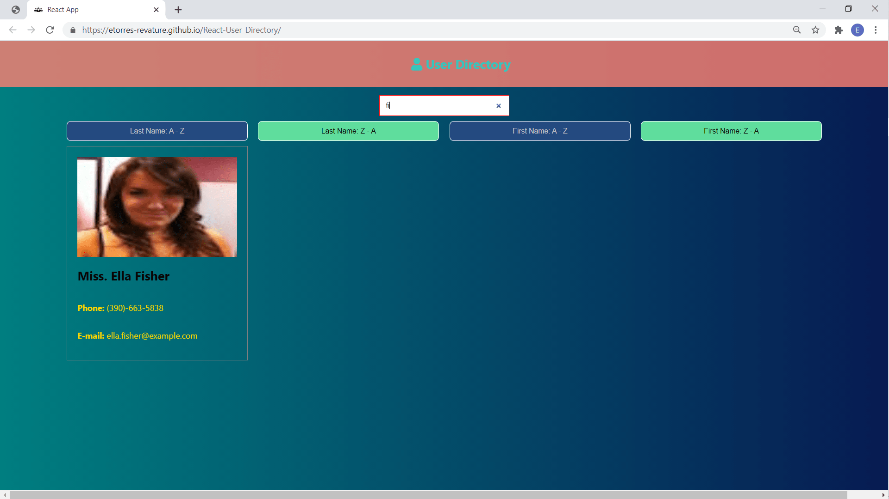
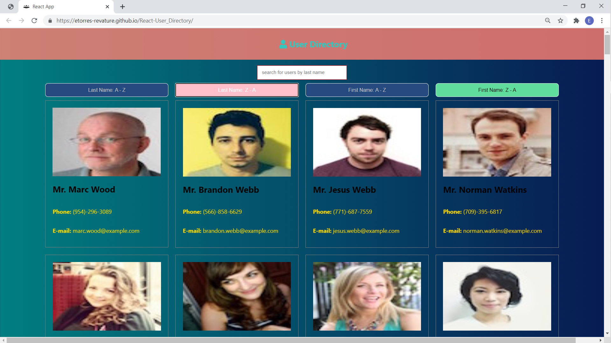

# React.js User Directory

## Project Description

This project uses the React.js library to create an app that makes an API call and then uses the app's "state" to manipulate that data. Data can be filtered through an input box; or, data can be sorted through various buttons.

## Table of Contents

- [Title](#project-title)
- [Description](#project-description)
- [Table of Contents](#table-of-contents)
- [Installation](#installation-instructions)
- [Usage](#usage)
- [Contributing](#guidelines-for-contributing)
- [Tests](#tests)
- [Technologies](#technologies-used)
- [Author](#author)
- [Questions](#questions)
- [License](#license)

## Installation Instructions

This project can be cloned or forked for personal use from the following [GitHub Repository](https://github.com/etorres-revature/React-User_Directory). Users can also explore the functionality of the [User Directory](https://etorres-revature.github.io/React-User_Directory/) as deployed to GitHub Pages.

## Usage

The [User Directory](https://etorres-revature.github.io/React-User_Directory/) is deployed on GitHub Pages.

Once the link is clicked, a loading gif will display until the User information is obtained from the [Random User Generator API](https://randomuser.me/).

Once the API call has been returned the [User Directory](https://etorres-revature.github.io/React-User_Directory/) will display the Users information.

The [User Directory](https://etorres-revature.github.io/React-User_Directory/) has an input box that will filter users by last name.

The [User Directory](https://etorres-revature.github.io/React-User_Directory/) has buttons that will sort users by both Last Name and First Name in alphabetical and reverse-alphabetical order:

1. **LAST NAME: A-Z**

2. **LAST NAME: Z-A**

3 **FIRST NAME: A-Z**

4. **FIRST NAME: Z-A**

## Guidelines for Contributing

Please send thoughts and idea for further upgades and/or improvements to the e-mail address below.

## Tests

Test early; test often.

### Technologies Used

### :computer: :computer: :computer: :computer: :computer: :computer:

#### :memo: HTML5 :memo:

**HTML5** is a markup language used for structuring and presenting content on the World Wide Web. The goals are to improve the language with support for the latest multi-media and other new features; to keep the language both easily readable by humans and consistently understood by computers and devices; and to remain backward compatible to older software. Many new symantec features are included.

_HTML5_ content borrowed from <a target="_blank" rel="noopener noreferrer">[this page](https://en.wikipedia.org/wiki/HTML5).</a>

#### :art: CSS :art:

**Cascading Style Sheets (CSS)** is a stylesheet language used for describing the presentation of a document written in a markup language (such as HTML5). CSS is designed to enable the separation of presentation and content; including layout, colors, and fonts. This separation improves content accessibility to provide more flexibility and control in the specification of presentation characteristics, enabling multiple web pages to share formatting by specifying relevant CSS in a separate file, which reduces complexity and repetition in the structural content (HTML), as well as enabling the file to be cached to improve the page load speed between the pages that share the file and its formatting.

Separation of formatting and content also makes it feasible to present the same markup page in different styles for different rendering methods, such as on-screen, in print, by voice, and on Braille-based tactile devices.

_CSS_ content borrowed from <a target="_blank" rel="noopener noreferrer">[this page](https://en.wikipedia.org/wiki/Cascading_Style_Sheets).</a>

#### :shoe: Bootstrap 4 :shoe:

#### :sparkler: JavaScript :sparkler:

**JavaScript (JS)** is one of the core technologies of the World Wide Web (along with HTML and CSS). It enables interactive web pages and is an essential part of web applications. JS is a multi-faceted, scripting language that provides versatility through Application Programming Interfaces (APIs) and Document Object Model (DOM) manipulation, among others.

_JavaScript_ content borrowed from <a target="_blank" rel="noopener noreferrer">[this page](https://en.wikipedia.org/wiki/JavaScript).</a>

#### :globe_with_meridians: NODE.js :globe_with_meridians:

**NODE.js** is an open-source, cross-platform JavaScript runtime environment that execute JavaScript code outside a web browser. NODE.js lets developers use JavaScript to write command line tools and for server-side scripting. NODE.js represents a "Javascript everywhere" paradigm, unifying web-application development around a single programming language, rather than different programming languages for server- and client-side scripts.

_NODE.js_ content borrowed from <a target="_blank" rel="noopener noreferrer">[this page](https://en.wikipedia.org/wiki/Node.js).</a>

[Download Node.js](https://nodejs.org/en/).

#### :dizzy: React.js :dizzy:

**React.js** is an open source JavaScript library that is used for building interfaces for single-page applications, which handles the view layer for web and mobile apps. React allows for the creation of reusable UI components. This allows developers to create large web applications that change data, without reloading the page.

_React.js_ content borrowed from <a target="_blank" rel="noopener noreferrer">[this page](https://www.c-sharpcorner.com/article/what-and-why-reactjs/#:~:text=It's%20used%20for%20handling%20the,to%20create%20reusable%20UI%20components.&text=React%20allows%20developers%20to%20create,fast%2C%20scalable%2C%20and%20simple.).</a>

### Author

This _React.js User Directory_ was built by :green_heart: Eric D. Torres :green_heart:

## Questions

Check out my [GitHub profile](https://github.com/etorres-revature).

You can contact me by e-mail at etorresnotary@gmail.com for any additional questions and/ or clarifications you may need about the project.

##### License

[This application uses the **MIT License* found here](./LICENSE).

**[This README.md file generated with my NODE.js README Generator app.](https://github.com/etorres-revature/NODEjs_README.md_Generator)**